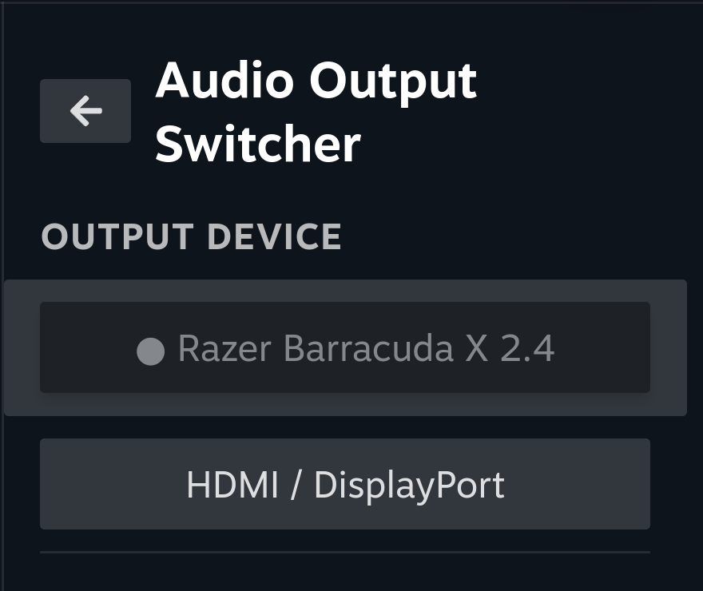

# Audio Output Switcher

A [Decky Loader](https://github.com/SteamDeckHomebrew/decky-loader) plugin that switches the default audio output device from the Quick Access Menu.



SteamOS gamemode has no output-device picker on every device — on a Steam Machine driving a TV, the QAM audio section is only a CEC volume slider. Changing outputs otherwise means a trip to desktop mode. This plugin lists every available sink and switches with one tap.

## Features

- Lists all available audio outputs, active device marked and pinned to the top
- Switches the default sink **and moves already-playing streams**, so audio follows immediately instead of only affecting the next sound
- Repolls while the panel is open, so wireless headsets appearing and disappearing are reflected without a reload

## Install

**From the Decky store:** search for "Audio Output Switcher" in the Decky plugin browser.

**Manually:** copy this directory to `~/homebrew/plugins/audio-output-switcher` on your device, then restart Decky:

```bash
sudo cp -r audio-output-switcher ~/homebrew/plugins/
sudo chown -R root:root ~/homebrew/plugins/audio-output-switcher
sudo systemctl restart plugin_loader
```

## How it works

The backend (`main.py`) shells out to `pactl`:

- `pactl -f json list sinks` for the device list, `pactl get-default-sink` for current state
- Switching runs `set-default-sink` **and then** `move-sink-input` for every live stream. `set-default-sink` alone only affects streams that start *afterward*, so without the move pass whatever is already playing keeps going out the old device.

If Decky runs the backend as root, commands are re-run as the `deck` user with `XDG_RUNTIME_DIR` set, so it can reach the user's PipeWire session either way.

## Building

```bash
pnpm i
pnpm run build
```

Outputs `dist/index.js`.

## License

MIT — see [LICENSE](LICENSE). Retains the BSD-3-Clause license of the [decky-plugin-template](https://github.com/SteamDeckHomebrew/decky-plugin-template) it derives from.
